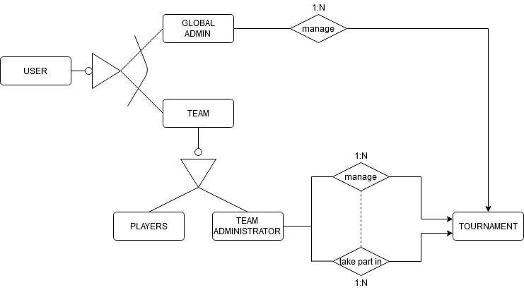

# TenniShip

TenniShip is a web app for managing tennis tournaments inspired in Davis Cup rules. It allows users to find teams, matches, keep track of scores, and check their standings in tourneys. 

The home page has two search bars: one for tournaments and another one for teams. This search bars are only for queries, so they redirect you to the team or tournament information sheet. There's another slide below, that explains what TenniShip can do and links the user to various actions.

Users can sign up in TenniShip as teams. Such as in Davis Cup, every team must have five players.

Tournament information sheets indicate the actual phase of the tournament, its teams and its progress.

When a game is played, teams must log the result. In case of disagreement, tournament's administrator will be noticed so they decide.

Team Sheet contains information about a team. It includes the team's logo, its players with their picture and name (on mouse hover), the tournaments played by them and their most recent results. There's a pie chart that showcases the percentage of matches played in each tournament. This screenshot was taken with zoom out.

## Built With

TenniShip has been made with HTML, CSS and JavaScript. BizPage Bootstrap template has been used and modified.

## Technical details
### Entities
TenniShip has four different entities: match, tournament, team and user role. 

### Users
TenniShip has three different users: administrator, registered user and non-registered user.
+ _Non-registered users_ can only see tournaments and teams information.
+ _Registered users_ can only see tournaments and teams information on those tournaments that they are not its administrator.
+ _Administrators_ can modify tournaments information on those who they are its administrator. For the rest of tournaments they are simple _registered users_.

### Pictures
+ Tournament has an image as its logo.
+ Each team has 6 images: the team logo, and a profile picture for the five team members.

### Charts
In team's details appears a pie chart that automatically calculates and shows the percentage of matches played in each tournament.

### Additional technology
An e-mail will be sent in three different situations: when you register your TenniShip account, then a team is disqualified from a tournament your are playing in and when a tournament that you are into is deleted.

### Advanced algorithm or query
Tournaments will automatically reorganize themselves when a match is played.

## Screen transitions.

+ __Straight__ arrows show how _non-registered users_ can navigate throw the website.

+ Arrows that start with a __circle__ show how _registered users_ can navigate throw the website.
+ Arrows that start with a __rhombus__ show how _administrator users_ can navigate throw the website.

## Authors

* Iván Fernández Llorente - [Ivan's GitHub](https://github.com/IvanFernandezLlorente/ "IvanFernandezLlorente") - [Ivan's e-mail](mailto:i.fernandezl.2017@alumnos.urjc.es "Send e-mail")
* Santiago González Martin - [Santi's GitHub](https://github.com/SantiagoGnzlz/ "SantiagoGnzlz") - [Santi's e-mail](mailto:s.gonzalezm.2016@alumnos.urjc.es "Send e-mail")
* Diego Pascual Ferrer - [Diego's GitHub](https://github.com/Diegopasfer1909/ "Diegopasfer1909") - [Diego's e-mail](mailto:d.pascual.2017@alumnos.urjc.es "Send e-mail")
* Alvaro Justo Rivas Alcobendas - [Álvaro's GitHub](https://github.com/Varo412/ "Varo412") - [Álvaro's e-mail](mailto:aj.rivas.2017@alumnos.urjc.es "Send e-mail")
* Marcos Villacañas Flores - [Marcos' GitHub](https://github.com/MarcosVillacanas/ "MarcosVillacanas") - [Marcos' e-mail](mailto:m.villacanas.2017@alumnos.urjc.es "Send e-mail")

## License
© BizPage Bootstrap template has been designed by BootstrapMade. [Original Bizpage Template](https://bootstrapmade.com/demo/BizPage/ "Bizpage").

