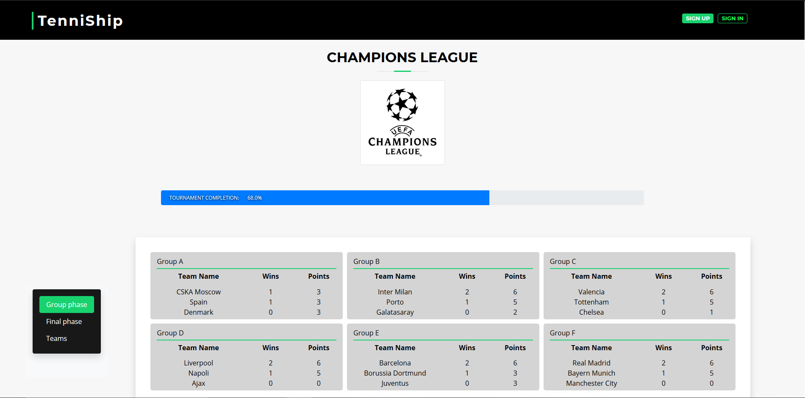

# TenniShip

TenniShip is a web app for managing tennis tournaments inspired in Davis Cup rules. It allows users to find teams, matches, keep track of scores, and check their standings in tourneys. 


The home page has two search bars: one for tournaments and another one for teams. This search bars are only for queries, so they redirect you to the team or tournament information sheet. There's another slide below, that explains what TenniShip can do and links the user to various actions.


Users can sign up in TenniShip as team leaders. Such as in Davis Cup official tournament, every team must have five players.




Tournament information sheets indicate the actual phase of the tournament, its teams and its progress.


When a game is played, teams must log the result.


Team Sheet contains information about a team. It includes the team's logo, its players with their picture and name (on mouse hover), the tournaments played by them and their most recent results. There's a pie chart that showcases the percentage of matches won and lost in each tournament.


## Built With

TenniShip has been made with HTML, CSS and JavaScript. BizPage Bootstrap template has been used and modified.

## Authors

* Iván Fernández Llorente - [Ivan's GitHub](https://github.com/IvanFernandezLlorente/ "IvanFernandezLlorente") - [Ivan's e-mail](mailto:i.fernandezl.2017@alumnos.urjc.es "Send e-mail")
* Santiago González Martin - [Santi's GitHub](https://github.com/SantiagoGnzlz/ "SantiagoGnzlz") - [Santi's e-mail](mailto:s.gonzalezm.2016@alumnos.urjc.es "Send e-mail")
* Diego Pascual Ferrer - [Diego's GitHub](https://github.com/Diegopasfer1909/ "Diegopasfer1909") - [Diego's e-mail](mailto:d.pascual.2017@alumnos.urjc.es "Send e-mail")
* Alvaro Justo Rivas Alcobendas - [Álvaro's GitHub](https://github.com/Varo412/ "Varo412") - [Álvaro's e-mail](mailto:aj.rivas.2017@alumnos.urjc.es "Send e-mail")
* Marcos Villacañas Flores - [Marcos' GitHub](https://github.com/MarcosVillacanas/ "MarcosVillacanas") - [Marcos' e-mail](mailto:m.villacanas.2017@alumnos.urjc.es "Send e-mail")


# Phase 2

## Technical details
### Entities
TenniShip has five different entities: match, tournament, team, player and user role. 


### Classes and templates diagram


### Users
TenniShip has three different users: administrator, registered user and non-registered user.
+ _Non-registered users_ can only see tournaments and teams information.
+ _Registered users_ can see tournaments and teams information and register matches on those tournaments they play at.
+ _Administrators_ can modify tournaments information.

### Development
#### Source Code
[Source Code Repository](https://github.com/CodeURJC-DAW-2019-20/webapp2 "GitHub").

#### Development tools
+ Spring Tool Suite 4.
+ MySQL Server 8.0.
+ MySQL WorkBench 8.0.
#### Dependencies
+ MSQL Server 8.0.
+ Spring framework.
+ Mustache.
+ Springboot starter mail.
+ Springboot starter security.

#### How to manage the project with Eclipse STS4.
1. Clone the [repository](https://github.com/CodeURJC-DAW-2019-20/webapp2 "GitHub") or [download the ZIP](https://github.com/CodeURJC-DAW-2019-20/webapp2/archive/master.zip "ZIP file").
2. Open SpringToolSuite4 >> File >> Open Projects from File System.
3. Select '/webapp' folder.
4. Import both Maven and Eclipse Projects and click on Finish.
- To run the application select 'Run As >> Spring Boot App'.
- To build the project select 'Project >> Build Project' if 'Build Automatically is not selected (recommended to)'.

#### Basic installarion of MySQL Server and MySQL Workbench (recommended) on Windows.
1. [Download MySQL Windows Installer](https://dev.mysql.com/get/Downloads/MySQLInstaller/mysql-installer-community-8.0.19.0.msi "MySQL Windows Installer").
2. Run it as administrator.
3. In 'Choosing a Setup Type' select *Developer Default*.
4. In 'Check Requirements' screen install every of the items showed so the app works fine.
5. Execute the installation of the products (MySQL Server must be there).
6. Next.
7. In 'High Avaliability' screen select *Standalone MySQL Server / Classic MySQL Replication* option.
8. Next >> Next.
9. Write a Password.
10. Next >> Execute >> Finnish till installation ends.

### Entities with pictures
+ Tournament has an image as its logo.
+ Each team has 6 images: the team logo, and a profile picture for the five team members.

### Charts
In team's details appears a pie chart that automatically calculates and shows matches won and lost graphically.

### Additional technology
An e-mail will be sent  when you register your TenniShip account.

### Advanced algorithm or query
Tournaments will automatically reorganize themselves when a match is played.

## Screen transitions.

+ __Straight__ arrows show how _non-registered users_ can navigate throw the website.

+ Arrows that start with a __circle__ show how _registered users_ can navigate throw the website.
+ Arrows that start with a __rhombus__ show how _administrator users_ can navigate throw the website.


## Process Tools
We used [Trello](https://trello.com/b/uJDmvvK9/daw-tareas/ "TenniShip Trello") for tasks management.

## Authors' participation
* Iván: 
	- Tasks:
		- Security, HTTPS and needed roles added. Authenticated users sessions added too. 
		- Sign in and Sign Up are available
		- Tournament Creator with its whole complexity.
		- Admin Role functions, deleting tournaments option available, edit matches option available too.
		- Error control system.
	- Top 5 most important commits in 'Second Phase':
		- [Security](https://github.com/CodeURJC-DAW-2019-20/webapp2/commit/7f240b58b11e45f423a56eea8ca2ff36d8dcfe2e "7f240b5") 
		- [Sign In and Sign up](https://github.com/CodeURJC-DAW-2019-20/webapp2/commit/a9edf05acc9d203045504abfeac3a1533f1a24c7 "a9edf05") 
		- [Tournament Creator](https://github.com/CodeURJC-DAW-2019-20/webapp2/commit/2ce263e2dfd2874f67f142123617b25ab63c2ba3 "2ce263e") 
		- [Admin Role and Tournament Information!](https://github.com/CodeURJC-DAW-2019-20/webapp2/commit/85b2a1859dd01387adc98e0c1a7056353ac56527 "85b2a18") 
		- [Errors contempled](https://github.com/CodeURJC-DAW-2019-20/webapp2/commit/461fd6d754ab028439e62393bb9cb0cf1e980fa1 "461fd6d") 
	- Top 5 most modified files:
		- [Creator Controller](https://github.com/CodeURJC-DAW-2019-20/webapp2/blob/master/backend/tenniShip/src/main/java/com/practica/creator/CreatorController.java "CreatorController.java ") 
		- [User Controller](https://github.com/CodeURJC-DAW-2019-20/webapp2/blob/master/backend/tenniShip/src/main/java/com/practica/security/UserController.java "UserController.java") 
		- [Security Configuration](https://github.com/CodeURJC-DAW-2019-20/webapp2/blob/master/backend/tenniShip/src/main/java/com/practica/security/SecurityConfiguration.java "SecurityConfiguration.java") 
		- [Custom error controller](https://github.com/CodeURJC-DAW-2019-20/webapp2/blob/master/backend/tenniShip/src/main/java/com/practica/security/CustomErrorControler.java "CustomErrorControler.java") 
		- [Tournament Sheet Controller](https://github.com/CodeURJC-DAW-2019-20/webapp2/blob/master/backend/tenniShip/src/main/java/com/practica/tournamentsheet/TournamentSheetController.java "TournamentSheetController.java")
* Santi: 
	- Tasks:
		- Implement main search of tournaments and teams with autocomplete.
		- Add result pages of tournaments and teams to land on.
		- Ajax functionality on tournament selection
		- Mustache list rendering and format optimization
		- Pie chart and tournament progress bar functionality added
	- Top 5 most important commits in 'Second Phase':
		- [Team and Tournament Search fully functional](https://github.com/CodeURJC-DAW-2019-20/webapp2/commit/7a82e22d1701f660938597942e4053599b0dff3a "7a82e22")
		- [AJAX on Tournament Selection](https://github.com/CodeURJC-DAW-2019-20/webapp2/commit/2316124a8aa3ff8c1cc064c50633b12d3314b3cf "2316124")
		- [Adaptive recent matches](https://github.com/CodeURJC-DAW-2019-20/webapp2/commit/8d7fc95627f73960d8c0bd291ca5db60fb23e4f6 "8d7fc95")
		- [Search Box direct linking](https://github.com/CodeURJC-DAW-2019-20/webapp2/commit/d4fb335bb89e58e6e9d3ff8c110a86bb04bcf505 "d4fb335")
		- [Team autocomplete in Tournament Creator](https://github.com/CodeURJC-DAW-2019-20/webapp2/commit/78a2172144e56acd31528c94a290946f52381832 "78a2172")
	- Top 5 most modified files:
		- [Team Repository](https://github.com/CodeURJC-DAW-2019-20/webapp2/blob/master/backend/tenniShip/src/main/java/com/practica/team/TeamRepository.java)
		- [Main.js](https://github.com/CodeURJC-DAW-2019-20/webapp2/blob/master/backend/tenniShip/src/main/resources/static/js/main.js)
		- [Team Results](https://github.com/CodeURJC-DAW-2019-20/webapp2/blob/master/backend/tenniShip/src/main/resources/templates/teamResults.html)
		- [Team Controller](https://github.com/CodeURJC-DAW-2019-20/webapp2/blob/master/backend/tenniShip/src/main/java/com/practica/team/TeamController.java)
		- [Show More Content](https://github.com/CodeURJC-DAW-2019-20/webapp2/blob/master/backend/tenniShip/src/main/resources/static/js/showMoreContent.js)
* Diego: 
	- Tasks:
		- DataBase MySQL installation and queries.
		- Data Graphics and Team Carousel for Tournaments.
		- Entity Tournament, Tournament Controller and Bug fixing.
		- Teamfile AJAX Button for Matches reloading
		- Documentation: Diagrams
	- Top 5 most important commits in 'Second Phase':
		- [Database migration and completion chart added](https://github.com/CodeURJC-DAW-2019-20/webapp2/commit/9c55012c80ae8a250431ef2002aa0b057aa1264e "9c55012")
		- [Bugs Fixed, merge fixed and queries added](https://github.com/CodeURJC-DAW-2019-20/webapp2/commit/9ec1237a36df58061477bbf8687c22d5cbd4c422 "9ec1237")
		- [Teams Pie Chart added](https://github.com/CodeURJC-DAW-2019-20/webapp2/commit/eed9ca3747474a083d34076d21c7bbb05b35da46 "eed9ca3")
		- [Ajax Matches Reload](https://github.com/CodeURJC-DAW-2019-20/webapp2/commit/95d7f9b4fb722c7a58719c1e43b7b8d2e835497c "95d7f9b")
		- [Entity Tournament Created](https://github.com/CodeURJC-DAW-2019-20/webapp2/commit/81f4c104b6427b09ff2a9cf494aa21d5519ff8b0 "81f4c10")
	- Top 5 most modified files:
		- [ShowMoreContent.js](https://github.com/CodeURJC-DAW-2019-20/webapp2/blob/master/backend/tenniShip/src/main/resources/static/js/showMoreContent.js)
		- [TournamentController.java](https://github.com/CodeURJC-DAW-2019-20/webapp2/blob/master/backend/tenniShip/src/main/java/com/practica/tournament/TournamentController.java)
		- [TournamentSheetController.java](https://github.com/CodeURJC-DAW-2019-20/webapp2/blob/master/backend/tenniShip/src/main/java/com/practica/tournamentsheet/TournamentSheetController.java)
		- [TeamRepository.java](https://github.com/CodeURJC-DAW-2019-20/webapp2/blob/master/backend/tenniShip/src/main/java/com/practica/team/TeamRepository.java)
		- [TeamController.java](https://github.com/CodeURJC-DAW-2019-20/webapp2/blob/master/backend/tenniShip/src/main/java/com/practica/team/TeamController.java)
* Álvaro: 
	- Tasks:
		- Images upload.
		- Images visualization.
		- E-Mail sender: e-mail sent when a new user signs up.
		- Minor things: making Spring friendly with Bootstrap, documentation, spelling check, etc.
		- Insertion of sample data for demo.
	- Top 5 most important commits in 'Second Phase':
		- [Email implemented!](https://github.com/CodeURJC-DAW-2019-20/webapp2/commit/ed623ab115cc423e3d9282339be99007238e21cc "de0ce05") 
		- [Images implemented!](https://github.com/CodeURJC-DAW-2019-20/webapp2/commit/ed623ab115cc423e3d9282339be99007238e21cc "ed623ab") 
		- [Images implemented on header and Register Match!](https://github.com/CodeURJC-DAW-2019-20/webapp2/commit/f37bb40a44d591178751cc6f5f487d5578646f2c "f37bb40") 
		- [Project Fixed](https://github.com/CodeURJC-DAW-2019-20/webapp2/commit/25c47d3700c9e54fc956d58e9690c6a86463518e "25c47d3") 
		- [Tournament Sheet images, default avatar and minor fixes](https://github.com/CodeURJC-DAW-2019-20/webapp2/commit/26e9e5e5468259ccd846bb6973fa5b3a65deb495 "26e9e5e") 
	- Top 5 most modified files in 'Second Phase':
		- [Mail Sender] (https://github.com/CodeURJC-DAW-2019-20/webapp2/blob/master/backend/tenniShip/src/main/java/com/practica/MailSenderXX.java "MailSenderXX.java") 
		- [Images Service] (https://github.com/CodeURJC-DAW-2019-20/webapp2/blob/master/backend/tenniShip/src/main/java/com/practica/ImageService.java"Image Service") 
		- [Data Base Usage] (https://github.com/CodeURJC-DAW-2019-20/webapp2/blob/master/backend/tenniShip/src/main/java/com/practica/DataBaseUsage.java"DataBaseUsage.java") 
		- [Tournament Rest Controller] (https://github.com/CodeURJC-DAW-2019-20/webapp2/blob/master/backend/tenniShip/src/main/java/com/practica/tournament/TournamentRestController.java "TournamentRestController.java") 
		- [Team Rest Controller] (https://github.com/CodeURJC-DAW-2019-20/webapp2/blob/master/backend/tenniShip/src/main/java/com/practica/team/TeamRestController.java "TeamRestController.java") 
* Marcos: 
	- Tasks:
		- Data Base correctly implemented.
		- Make Register Match functional and fix its bugs.
		- Create Tournament Logic, team ranking, create matches, advanced sorting algorithm, tournament progression, useful queries and bugs fixed.
		- Admin Role functions, deleting tournaments option available, edit matches option available too.
		- Url and Navs uploaded.
	- Top 5 most important commits in 'Second Phase':
		- [Data Base!](https://github.com/CodeURJC-DAW-2019-20/webapp2/commit/1e4af4da28300f29a28b5b844d1ca5bbec686481 "1e4af4d") 
		- [Register Match and Tournament Logic Part 2!](https://github.com/CodeURJC-DAW-2019-20/webapp2/commit/d7ea968008a91a062786620b0aeb46877b84d2ec "d7ea968") 
		- [Tournament Logic Part 1!](https://github.com/CodeURJC-DAW-2019-20/webapp2/commit/25a45942692d692c46ce2d8bcaeb3a0068c7facc "25a4594") 
		- [Admin Role and Tournament Information!](https://github.com/CodeURJC-DAW-2019-20/webapp2/commit/85b2a1859dd01387adc98e0c1a7056353ac56527 "85b2a18") 
		- [Navs fixed!](https://github.com/CodeURJC-DAW-2019-20/webapp2/commit/a6cba970ad16ec86e72cf8c247a01423097f2818 "a6cba97") 
	- Top 5 most modified files:
		- [Tournament Sheet Controller](https://github.com/CodeURJC-DAW-2019-20/webapp2/blob/master/backend/tenniShip/src/main/java/com/practica/tournamentsheet/TournamentSheetController.java "TournamentSheetController.java") 
		- [Tournament Repository](https://github.com/CodeURJC-DAW-2019-20/webapp2/blob/master/backend/tenniShip/src/main/java/com/practica/tournament/TournamentRepository.java "TournamentRepository.java") 
		- [Data Base Usage](https://github.com/CodeURJC-DAW-2019-20/webapp2/blob/master/backend/tenniShip/src/main/java/com/practica/DataBaseUsage.java "DataBaseUsage.java") 
		- [Tournament Controller](https://github.com/CodeURJC-DAW-2019-20/webapp2/blob/master/backend/tenniShip/src/main/java/com/practica/tournament/TournamentController.java "TournamentController.java") 
		- [Team Repository](https://github.com/CodeURJC-DAW-2019-20/webapp2/blob/master/backend/tenniShip/src/main/java/com/practica/team/TeamRepository.java "TeamRepository.java")


# Phase 3

## ApiRest 

### Link to Api Documentation

Click on the next Link in order to consult the ApiRest user guide using Postman. [ApiRest Link](https://github.com/CodeURJC-DAW-2019-20/webapp2/blob/master/API.md "ApiRest Link")

## Updated Design

### Classes and templates diagram


## Docker

### Execution Guide

Take into account that previously git clone of this repository is needed, so that you are able to execute the script from:
```
...\webapp2\backend\tenniShip
```

The only step for executing the docker is to run the next script on CMD:
```
C:/Windows/System32/WindowsPowerShell/v1.0/powershell.exe -File <PreviousPath>\script.ps1
```

### Set-Up Guide

1. Create the network. 
```
docker network create tenniship-network
```
2. Create the Data Base Container. 
```
docker container run --name tennishipsql --network tenniship-network -e MYSQL_ROOT_PASSWORD=password -e MYSQL_DATABASE=tenniship -d mysql:8 
```
3. Change Application.properties. 
```
spring.datasource.url=jdbc:mysql://tennishipsql:3306/tenniship?useUnicode=true&useJDBCCompliantTimezoneShift=true&useLegacyDatetimeCode=false&serverTimezone=UTC 
```
4. Change pom.xml. 
```
<properties>
    <java.version>1.8</java.version>
    <start-class>com.practica.Application</start-class>
</properties> 
```
5. Create jar. 
```
docker run --rm -v "<Tenniship folder path>":/usr/src/project -w /usr/src/project maven:alpine mvn package
```
6. Create Dockerfile.
7. Build the image. 
```
docker image build -t padawansurjc/tennishipapp -f Docker/Dockerfile . 
```
8. Login in DockerHub. 
```
docker login 
```
9. Push the image to DockerHub. 
```
docker push padawansurjc/tennishipapp:latest
```
10. Create the TenniShip Container. 
```
docker container run --network tenniship-network --name tenniship-container -p 8443:8443 -d padawansurjc/tennishipapp
```
11. Create docker-compose.yml.

## Authors' participation
* Iván: 
	- Tasks:
		- Participation in the implementation of Docker
		- Participation in the implementation of REST API queries
		- Security development
		- General bug-fixing and error tracking
	- Top 5 most important commits in 'ThirdPhase':
		- [Docker Done!!!](https://github.com/CodeURJC-DAW-2019-20/webapp2/commit/35e215a35331ae9a7bbf6346ee2f479ed556b498 "6a6c735")
		- [RestStarting](https://github.com/CodeURJC-DAW-2019-20/webapp2/commit/8567c00fe29b015e5bd46cd665d0b90040b2945f "8567c00")
		- [JsonView used for complex returns](https://github.com/CodeURJC-DAW-2019-20/webapp2/commit/7cbba110f02a8a5d5b28a1ce39342d2ae2e047f0 "7cbba11")
		- [Services added](https://github.com/CodeURJC-DAW-2019-20/webapp2/commit/226494f4e39f09361d03b760d5ed84d0e4b7194a "226494f")
		- [Tournament Sheet Updated](https://github.com/CodeURJC-DAW-2019-20/webapp2/commit/ea4056803d9c50b8477411895ab73f498dc72ce8 "ea40568")
	- Top 5 most modified files:
		- [docker-compose.yml](https://github.com/CodeURJC-DAW-2019-20/webapp2/blob/master/backend/tenniShip/Docker/docker-compose.yml)
		- [CreatorRestController.java](https://github.com/CodeURJC-DAW-2019-20/webapp2/blob/master/backend/tenniShip/src/main/java/com/practica/creator/CreatorRestController.java)
		- [SecurityRestConfiguration.java](https://github.com/CodeURJC-DAW-2019-20/webapp2/blob/master/backend/tenniShip/src/main/java/com/practica/security/SecurityRestConfiguration.java)
		- [TournamentRestController.java](https://github.com/CodeURJC-DAW-2019-20/webapp2/blob/master/backend/tenniShip/src/main/java/com/practica/tournament/TournamentRestController.java)
		- [TournamentSheetRestController.java](https://github.com/CodeURJC-DAW-2019-20/webapp2/blob/master/backend/tenniShip/src/main/java/com/practica/tournamentsheet/TournamentSheetRestController.java)
* Santi: 
	- Tasks:
		- Creating REST API documentation
		- Porting Tournament Sheet methods to REST API
		- Completing initial Postman collection before link changes
		- API request error handling check
	- Top 5 most important commits in 'ThirdPhase':
		- [API.md created](https://github.com/CodeURJC-DAW-2019-20/webapp2/commit/655e06507468e2676b05358b760c90b9a82cf978)
		- [First changes to TournamentSheetRestController](https://github.com/CodeURJC-DAW-2019-20/webapp2/commit/f1b215d4789b4e3f59f0b729df399dac7d93bbc2)
		- [Ported tournamentSheet main method to REST](https://github.com/CodeURJC-DAW-2019-20/webapp2/commit/f3a53a4de2edc44e7e1e3fbefac674d7206be2d1)
		- [API.md updated with new urls](https://github.com/CodeURJC-DAW-2019-20/webapp2/commit/12ab317edededb3eae0c4757991a98da51d0fc35)
		- [Uploading Postman collection](https://github.com/CodeURJC-DAW-2019-20/webapp2/commit/1d4fed958ef093d95033fc4b8aba433c0bfd838e)
	- Top 5 most modified files:
		- [API.md](https://github.com/CodeURJC-DAW-2019-20/webapp2/blob/master/API.md)
		- [TournamentSheetRestController.java](https://github.com/CodeURJC-DAW-2019-20/webapp2/blob/master/backend/tenniShip/src/main/java/com/practica/tournamentsheet/TournamentSheetRestController.java)
		- [TournamentService.java](https://github.com/CodeURJC-DAW-2019-20/webapp2/blob/master/backend/tenniShip/src/main/java/com/practica/tournament/TournamentService.java)
		- [Postman collection](https://github.com/CodeURJC-DAW-2019-20/webapp2/blob/master/api.postman_collection.json)
		- [TournamentRestController.java](https://github.com/CodeURJC-DAW-2019-20/webapp2/blob/master/backend/tenniShip/src/main/java/com/practica/tournament/TournamentRestController.java)
* Diego: 
	- Tasks:
		- API implementation of Team
        	- Paging for Team
            	- Paging for Tournaments
                	- Documentation: Diagrams
                    	- Docker
	- Top 5 most important commits in 'Third Phase':
		- [Paging for Tournaments and Refactoring](https://github.com/CodeURJC-DAW-2019-20/webapp2/commit/1830bfedfe9dfe402b5686feed9d8e740af0a970 "837fcfb")
		- [Paging For Teams refactored and URLs refactored](https://github.com/CodeURJC-DAW-2019-20/webapp2/commit/837fcfbf2ea3de52337cd2b154781db845dd8d37 "c8cacb5")
		- [Documentation : Class Diagram](https://github.com/CodeURJC-DAW-2019-20/webapp2/commit/c8cacb542267c6ecbdd3ee3354d41aca527d8f79 "35e215a")
		- [API for TeamController](https://github.com/CodeURJC-DAW-2019-20/webapp2/commit/fb14eb053735a84a7c787e5181a352631ab5e1c9 "7cbba11")
		- [Docker Done!!!](https://github.com/CodeURJC-DAW-2019-20/webapp2/commit/35e215a35331ae9a7bbf6346ee2f479ed556b498 "6a6c735")
	- Top 5 most modified files:
		- [TeamRestController.java](https://github.com/CodeURJC-DAW-2019-20/webapp2/blob/master/backend/tenniShip/src/main/java/com/practica/team/TeamRestController.java)
		- [TournamentRestController.java](https://github.com/CodeURJC-DAW-2019-20/webapp2/blob/master/backend/tenniShip/src/main/java/com/practica/tournament/TournamentRestController.java)
		- [TeamService.java](https://github.com/CodeURJC-DAW-2019-20/webapp2/blob/master/backend/tenniShip/src/main/java/com/practica/team/TeamService.java)
		- [TeamRepository.java](https://github.com/CodeURJC-DAW-2019-20/webapp2/blob/master/backend/tenniShip/src/main/java/com/practica/team/TeamRepository.java)
		- [Dockerfile](https://github.com/CodeURJC-DAW-2019-20/webapp2/blob/master/backend/tenniShip/Docker/Dockerfile)
* Álvaro: 
	- Tasks:
		- Docker implementation (grupal commit)..
		- Images adaptation for Docker.
		- Images uploading and visualization via Res.
		- Access constraints via Res.
		- Managing images and email with new adaptation, and some API Rest Sentences.
	- Top 5 most important commits in 'ThirdPhase':
		- [Implemented authoritation improvements to Via Rest ](https://github.com/CodeURJC-DAW-2019-20/webapp2/commit/abcfcef0a0baa701b181b2ae5115b857829971ba) 
		- [Docker Done!!!](https://github.com/CodeURJC-DAW-2019-20/webapp2/commit/35e215a35331ae9a7bbf6346ee2f479ed556b498) 
		- [Images for Docker](https://github.com/CodeURJC-DAW-2019-20/webapp2/commit/0aac00c9995b7af7116ae88d817dae0b0fc941e3) 
		- [Email Security Fixed](https://github.com/CodeURJC-DAW-2019-20/webapp2/commit/7c6a749049e47e932a9ddf9d3f4d808faccd25db) 
		- [Images Implemented via Rest](https://github.com/CodeURJC-DAW-2019-20/webapp2/commit/689aa6a8991ca074ff077d2709ccd35aa9270480) 
	- Top 5 most modified files in 'Third Phase':
		- [CreatorRestController](https://github.com/CodeURJC-DAW-2019-20/webapp2/blob/master/backend/tenniShip/src/main/java/com/practica/creator/CreatorRestController.java "CreatorRestController.java") 
		- [UserRestController](https://github.com/CodeURJC-DAW-2019-20/webapp2/blob/master/backend/tenniShip/src/main/java/com/practica/security/UserRestController.java "UserRestController.java") 
		- [SecurityRestConfiguration](https://github.com/CodeURJC-DAW-2019-20/webapp2/blob/master/backend/tenniShip/src/main/java/com/practica/security/SecurityRestConfiguration.java "SecurityRestConfiguration.java") 
		- [docker-compose](https://github.com/CodeURJC-DAW-2019-20/webapp2/blob/master/backend/tenniShip/Docker/docker-compose.yml "docker-compose.yml") 
		- [TeamRestController](https://github.com/CodeURJC-DAW-2019-20/webapp2/blob/master/backend/tenniShip/src/main/java/com/practica/team/TeamRestController.java "TeamRestController.java") 
* Marcos: 
	- Tasks:
		- Cleaning-Code.
		- ApiRest co- implementation.
		- Bugs-fixing.
		- Docker co-implementation.
		- Documentation.
	- Top 5 most important commits in 'Third Phase':
		- [Cleaning Code!](https://github.com/CodeURJC-DAW-2019-20/webapp2/commit/9dead5560cf94a6397f1e26fa67b4195bdd27469 "9dead55") 
		- [Api-Rest Starting!](https://github.com/CodeURJC-DAW-2019-20/webapp2/commit/9c6616e4bdb1965f000e802a0845ab89f1260276 "9c6616e") 
		- [Json Views!](https://github.com/CodeURJC-DAW-2019-20/webapp2/commit/7cbba110f02a8a5d5b28a1ce39342d2ae2e047f0 "7cbba11") 
		- [Docker!](https://github.com/CodeURJC-DAW-2019-20/webapp2/commit/35e215a35331ae9a7bbf6346ee2f479ed556b498 "35e215a") 
		- [Documentation!](https://github.com/CodeURJC-DAW-2019-20/webapp2/commit/c8afc590c381b8d98f8629144d4e56ac89a7f0ad "c8afc59") 
	- Top 5 most modified files:
		- [SecurityRestConfiguration](https://github.com/CodeURJC-DAW-2019-20/webapp2/blob/master/backend/tenniShip/src/main/java/com/practica/security/SecurityRestConfiguration.java "SecurityRestConfiguration.java") 
		- [Team Repository](https://github.com/CodeURJC-DAW-2019-20/webapp2/blob/master/backend/tenniShip/src/main/java/com/practica/team/TeamRepository.java "TeamRepository.java") 
		- [TournamentSheetRestController](https://github.com/CodeURJC-DAW-2019-20/webapp2/blob/master/backend/tenniShip/src/main/java/com/practica/tournamentsheet/TournamentSheetRestController.java "TournamentSheetRestController.java") 
		- [ExecutionScript](https://github.com/CodeURJC-DAW-2019-20/webapp2/blob/master/backend/tenniShip/script.ps1 "script.ps1") 
		- [README](https://github.com/CodeURJC-DAW-2019-20/webapp2/blob/master/README.md "ReadMe.md")


## License
© BizPage Bootstrap template has been designed by BootstrapMade. [Original Bizpage Template](https://bootstrapmade.com/demo/BizPage/ "Bizpage").