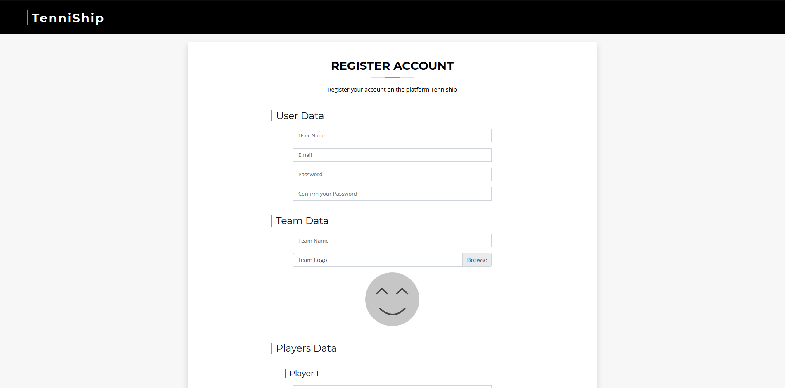

# TenniShip

TenniShip is a web app for managing tennis tournaments inspired in Davis Cup rules. It allows users to find teams, matches, keep track of scores, and check their standings in tourneys. 


The home page has two search bars: one for tournaments and another one for teams. This search bars are only for queries, so they redirect you to the team or tournament information sheet. There's another slide below, that explains what TenniShip can do and links the user to various actions.



Users can sign up in TenniShip as team leaders. Such as in Davis Cup official tournament, every team must have five players.


Tournament information sheets indicate the actual phase of the tournament, its teams and its progress.


When a game is played, teams must log the result. In case of disagreement, tournament's administrator will be noticed so they decide.


Team Sheet contains information about a team. It includes the team's logo, its players with their picture and name (on mouse hover), the tournaments played by them and their most recent results. There's a pie chart that showcases the percentage of matches played in each tournament. This screenshot was taken with zoom out.


## Built With

TenniShip has been made with HTML, CSS and JavaScript. BizPage Bootstrap template has been used and modified.

## Technical details
### Entities
TenniShip has five different entities: match, tournament, team, player and user role. 


### Users
TenniShip has three different users: administrator, registered user and non-registered user.
+ _Non-registered users_ can only see tournaments and teams information.
+ _Registered users_ can see tournaments and teams information and register matches on those tournaments they play at.
+ _Administrators_ can modify tournaments information.

### Development
#### Source Code
[Source Code Repository](https://github.com/CodeURJC-DAW-2019-20/webapp2 "GitHub").

#### Development tools
+ Spring Tool Suite 4.
+ MySQL Server 8.0.
+ MySQL WorkBench 8.0.
#### Dependencies
+ MSQL Server 8.0.

#### Useful commands
Generate MySQL schema:
``` shell
insert commands here
```
Build application:
``` shell
insert commands here
```
Run application:
``` shell
insert commands here
```
### Pictures
+ Tournament has an image as its logo.
+ Each team has 6 images: the team logo, and a profile picture for the five team members.

### Charts
In team's details appears a pie chart that automatically calculates and shows matches won and lost graphically.

### Additional technology
An e-mail will be sent  when you register your TenniShip account.

### Advanced algorithm or query
Tournaments will automatically reorganize themselves when a match is played.

## Screen transitions.

+ __Straight__ arrows show how _non-registered users_ can navigate throw the website.

+ Arrows that start with a __circle__ show how _registered users_ can navigate throw the website.
+ Arrows that start with a __rhombus__ show how _administrator users_ can navigate throw the website.


## Process Tools
We used [Trello](https://trello.com/b/uJDmvvK9/daw-tareas/ "TenniShip Trello") for tasks management.

## Authors

* Iván Fernández Llorente - [Ivan's GitHub](https://github.com/IvanFernandezLlorente/ "IvanFernandezLlorente") - [Ivan's e-mail](mailto:i.fernandezl.2017@alumnos.urjc.es "Send e-mail")
* Santiago González Martin - [Santi's GitHub](https://github.com/SantiagoGnzlz/ "SantiagoGnzlz") - [Santi's e-mail](mailto:s.gonzalezm.2016@alumnos.urjc.es "Send e-mail")
* Diego Pascual Ferrer - [Diego's GitHub](https://github.com/Diegopasfer1909/ "Diegopasfer1909") - [Diego's e-mail](mailto:d.pascual.2017@alumnos.urjc.es "Send e-mail")
* Alvaro Justo Rivas Alcobendas - [Álvaro's GitHub](https://github.com/Varo412/ "Varo412") - [Álvaro's e-mail](mailto:aj.rivas.2017@alumnos.urjc.es "Send e-mail")
* Marcos Villacañas Flores - [Marcos' GitHub](https://github.com/MarcosVillacanas/ "MarcosVillacanas") - [Marcos' e-mail](mailto:m.villacanas.2017@alumnos.urjc.es "Send e-mail")

#### Authors' participation
* Iván: 
	- Tasks:
		- Security, HTTPS and needed roles added. Authenticated users sessions added too. 
		- Sign in and Sign Up are available
		- Tournament Creator with its whole complexity.
		- Admin Role functions, deleting tournaments option available, edit matches option available too.
		- Error control system.
	- Top 5 most important commits in 'Second Phase':
		- [Security](https://github.com/CodeURJC-DAW-2019-20/webapp2/commit/7f240b58b11e45f423a56eea8ca2ff36d8dcfe2e "7f240b5") 
		- [Sign In and Sign up](https://github.com/CodeURJC-DAW-2019-20/webapp2/commit/a9edf05acc9d203045504abfeac3a1533f1a24c7 "a9edf05") 
		- [Tournament Creator](https://github.com/CodeURJC-DAW-2019-20/webapp2/commit/2ce263e2dfd2874f67f142123617b25ab63c2ba3 "2ce263e") 
		- [Admin Role and Tournament Information!](https://github.com/CodeURJC-DAW-2019-20/webapp2/commit/85b2a1859dd01387adc98e0c1a7056353ac56527 "85b2a18") 
		- [Errors contempled](https://github.com/CodeURJC-DAW-2019-20/webapp2/commit/461fd6d754ab028439e62393bb9cb0cf1e980fa1 "461fd6d") 
	- Top 5 most modified files:
		- [Creator Controller](https://github.com/CodeURJC-DAW-2019-20/webapp2/blob/master/tenniShip/src/main/java/com/practica/CreatorController.java "CreatorController.java ") 
		- [User Controller](https://github.com/CodeURJC-DAW-2019-20/webapp2/blob/master/tenniShip/src/main/java/com/practica/security/UserController.java "UserController.java") 
		- [Security Configuration](https://github.com/CodeURJC-DAW-2019-20/webapp2/blob/master/tenniShip/src/main/java/com/practica/security/SecurityConfiguration.java "SecurityConfiguration.java") 
		- [Custom error controller](https://github.com/CodeURJC-DAW-2019-20/webapp2/blob/master/tenniShip/src/main/java/com/practica/security/CustomErrorControler.java "CustomErrorControler.java") 
		- [Tournament Sheet Controller](https://github.com/CodeURJC-DAW-2019-20/webapp2/blob/master/tenniShip/src/main/java/com/practica/TournamentSheetController.java "TournamentSheetController.java")
* Santi: 
	- Tasks:
		- d
	- Top 5 most important commits in 'Second Phase':
		- d
	- Top 5 most modified files:
		- d
* Diego: 
	- Tasks:
		- d
	- Top 5 most important commits in 'Second Phase':
		- d
	- Top 5 most modified files:
		- d
* Álvaro: 
	- Tasks:
		- Images upload.
		- Images visualization.
		- E-Mail sender: e-mail sent when a new user signs up.
		- Documentation: Readme.
		- Insertion of sample data for demo.
	- Top 5 most important commits in 'Second Phase':
		- [Email implemented!](https://github.com/CodeURJC-DAW-2019-20/webapp2/commit/ed623ab115cc423e3d9282339be99007238e21cc "de0ce05") 
		- [Images implemented!](https://github.com/CodeURJC-DAW-2019-20/webapp2/commit/ed623ab115cc423e3d9282339be99007238e21cc "ed623ab") 
		- [Images implemented on header and Register Match!](https://github.com/CodeURJC-DAW-2019-20/webapp2/commit/f37bb40a44d591178751cc6f5f487d5578646f2c "f37bb40") 
		- [Project Fixed](https://github.com/CodeURJC-DAW-2019-20/webapp2/commit/25c47d3700c9e54fc956d58e9690c6a86463518e "25c47d3") 
		- [Tournament Sheet images, default avatar and minor fixes](https://github.com/CodeURJC-DAW-2019-20/webapp2/commit/26e9e5e5468259ccd846bb6973fa5b3a65deb495 "26e9e5e") 
	- Top 5 most modified files in 'Second Phase':
		- [Mail Sender](https://github.com/CodeURJC-DAW-2019-20/webapp2/blob/master/tenniShip/src/main/java/com/practica/MailSenderXX.java "MailSenderXX.java") 
		- [Images Service](https://github.com/CodeURJC-DAW-2019-20/webapp2/blob/master/tenniShip/src/main/java/com/practica/ImageService.java "Image Service") 
		- [Data Base Usage](https://github.com/CodeURJC-DAW-2019-20/webapp2/blob/master/tenniShip/src/main/java/com/practica/DataBaseUsage.java "DataBaseUsage.java") 
		- [Tournament Rest Controller](https://github.com/CodeURJC-DAW-2019-20/webapp2/blob/master/tenniShip/src/main/java/com/practica/TournamentRestController.java "TournamentRestController.java") 
		- [Team Rest Controller](https://github.com/CodeURJC-DAW-2019-20/webapp2/blob/master/tenniShip/src/main/java/com/practica/TeamRestController.java "TeamRestController.java") 
* Marcos: 
	- Tasks:
		- Data Base correctly implemented.
		- Make Register Match functional and fix its bugs.
		- Create Tournament Logic, team ranking, create matches, advanced sorting algorithm, tournament progression, useful querys and bugs fixed.
		- Admin Role functions, deleting tournaments option available, edit matches option available too.
		- Url and Navs uploaded.
	- Top 5 most important commits in 'Second Phase':
		- [Data Base!](https://github.com/CodeURJC-DAW-2019-20/webapp2/commit/1e4af4da28300f29a28b5b844d1ca5bbec686481 "1e4af4d") 
		- [Register Match and Tournament Logic Part 2!](https://github.com/CodeURJC-DAW-2019-20/webapp2/commit/d7ea968008a91a062786620b0aeb46877b84d2ec "d7ea968") 
		- [Tournament Logic Part 1!](https://github.com/CodeURJC-DAW-2019-20/webapp2/commit/25a45942692d692c46ce2d8bcaeb3a0068c7facc "25a4594") 
		- [Admin Role and Tournament Information!](https://github.com/CodeURJC-DAW-2019-20/webapp2/commit/85b2a1859dd01387adc98e0c1a7056353ac56527 "85b2a18") 
		- [Navs fixed!](https://github.com/CodeURJC-DAW-2019-20/webapp2/commit/a6cba970ad16ec86e72cf8c247a01423097f2818 "a6cba97") 
	- Top 5 most modified files:
		- [Tournament Sheet Controller](https://github.com/CodeURJC-DAW-2019-20/webapp2/blob/master/tenniShip/src/main/java/com/practica/TournamentSheetController.java "TournamentSheetController.java") 
		- [Tournament Repository](https://github.com/CodeURJC-DAW-2019-20/webapp2/blob/master/tenniShip/src/main/java/com/practica/TournamentRepository.java "TournamentRepository.java") 
		- [Data Base Usage](https://github.com/CodeURJC-DAW-2019-20/webapp2/blob/master/tenniShip/src/main/java/com/practica/DataBaseUsage.java "DataBaseUsage.java") 
		- [Tournament Controller](https://github.com/CodeURJC-DAW-2019-20/webapp2/blob/master/tenniShip/src/main/java/com/practica/TournamentController.java "TournamentController.java") 
		- [Team Repository](https://github.com/CodeURJC-DAW-2019-20/webapp2/blob/master/tenniShip/src/main/java/com/practica/TeamRepository.java "TeamRepository.java")

## License
© BizPage Bootstrap template has been designed by BootstrapMade. [Original Bizpage Template](https://bootstrapmade.com/demo/BizPage/ "Bizpage").

